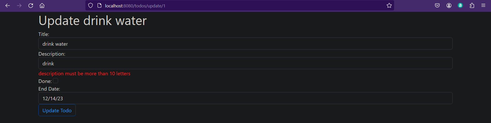
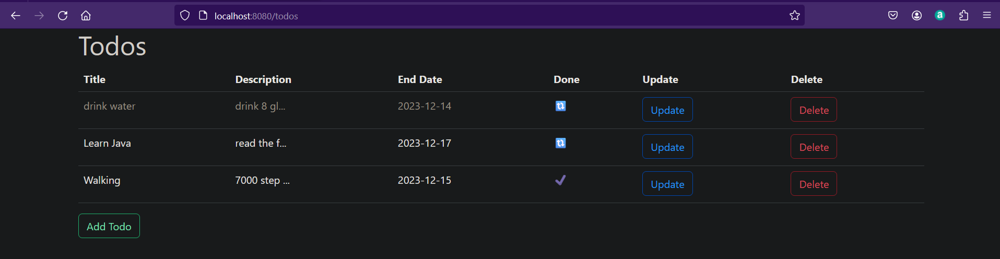

# Todo Website

## Tools
  - Spring & Spring-boot
  - Mysql
  - Log4J & SLF4J 
  - Thymeleaf
  - Bootstrap
  - ModelMapper
  - Lombok

## Auth
  - custome Authentication using Sessions
    - Register & login
  - cutome Autorization using interceptor
    - The application redirect the requests to login if the user is not authenticated
    - The user cannot list, update or delete the items of other authors 

## Validation
  - Using DTOs to validate the the input from the forms
  - And using Mapper to convert the dto to the original entity
  - the validation appear in the page
  

## Todo
  - Make CRUD operations on the todos 
    - with authorization
  

